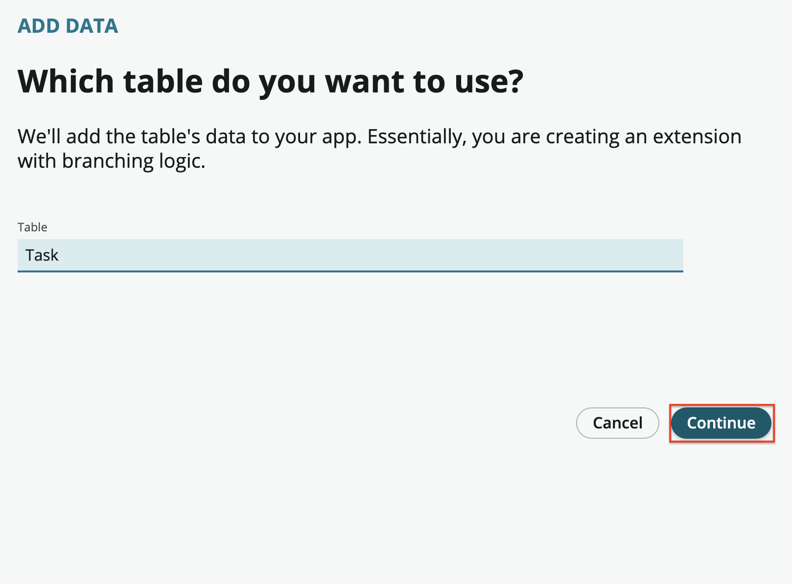

# Base Dept Task Table

[Next][NEXT]{: .btn .btn-purple }

The first step in creating an application is defining the data. This lab will utilize the table inheritance feature of the platform.

We will be creating a Dept Task table that will be the basis of all other tables. The Dept Task table will extend the system Task table. This will allow the Dept Services application to access base fields and capabilities of the platform such as assigning requests to users and asking for approvals.

1. Once the **App Home** tab opens, select **Add a table or upload a spreadsheet**

    

2. Select **Create a table** and then the **Get started** on the next screen
    
    

    

3. Select the **Create from an existing table** option and then **Continue**

    

4. Set the **Table** field to **Task** and select **Continue**

    

    

5. Set the **Table label** field to **Dept Task**\
    Select **Make extensible**\
    Select **Auto number**\
    Set the **Prefix** field to **DEPTTASK**

        

6. The next step is to setup permission for the Dept Task table. Assign full permissions to the admin role by selecting **All**. Select the **Create**, **Read** and **Write** permissions for the user role

    

 7. Select **Done** once the table is created to return to **App Home**
    
    

Excellent! In our next exercise we'll create our Request tables and add some department specific fields.

[Next][NEXT]{: .btn .btn-purple }

[NEXT]: ../40_dept_req_table